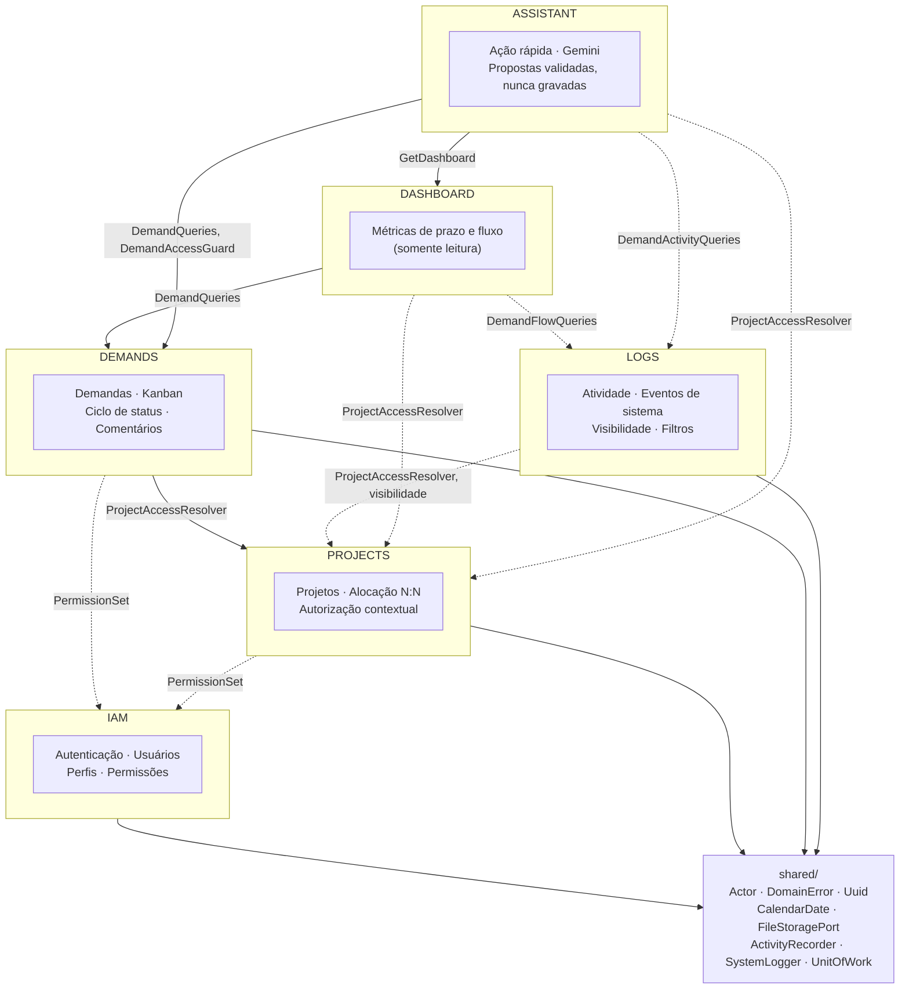
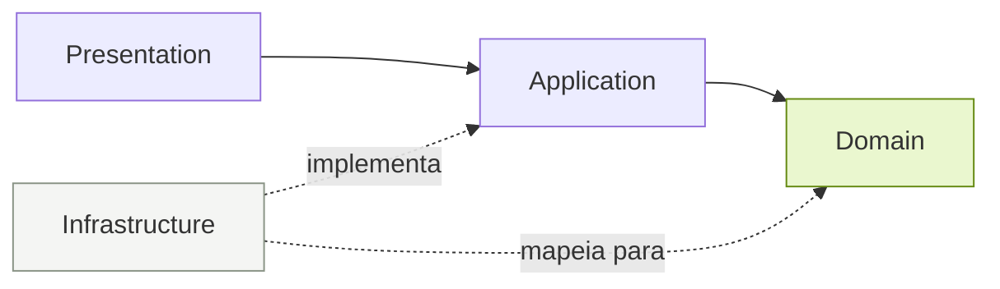
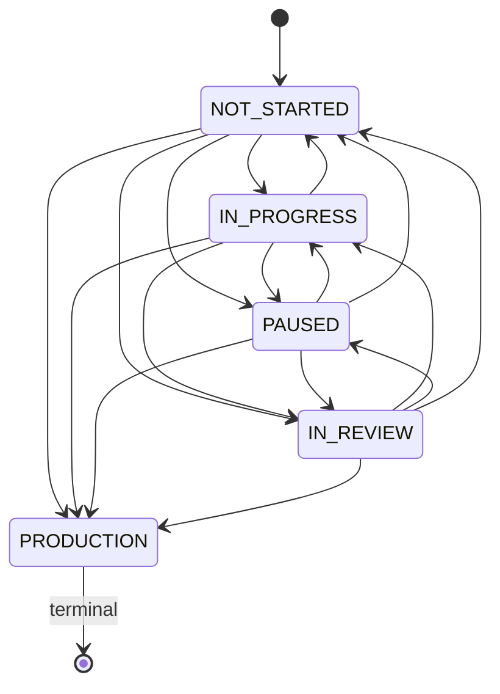
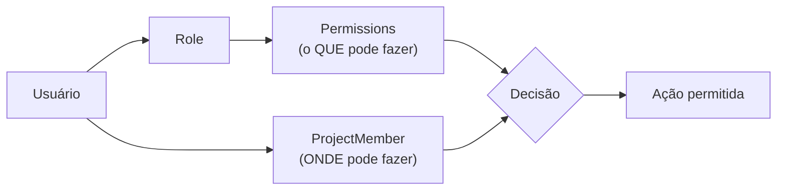
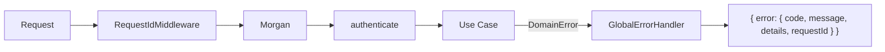
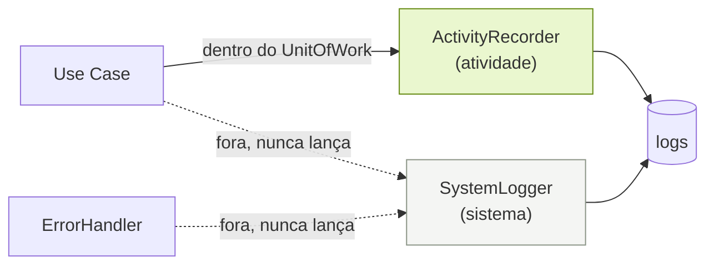

# Arquitetura

## Sumário

- [Decisão central](#decisão-central)
- [Modular Monolith](#modular-monolith)
- [Camadas e fluxo de dependência](#camadas-e-fluxo-de-dependência)
- [Regras de fronteira](#regras-de-fronteira)
- [State Pattern — ciclo da demanda](#state-pattern--ciclo-da-demanda)
- [Autorização em duas dimensões](#autorização-em-duas-dimensões)
- [Identificadores](#identificadores)
- [Composition Root](#composition-root)
- [Portas e adapters](#portas-e-adapters)
- [Tratamento de erros](#tratamento-de-erros)
- [Transações](#transações)
- [Logs: atividade e sistema](#logs-atividade-e-sistema)
- [Frontend](#frontend)
- [Decisões e trade-offs](#decisões-e-trade-offs)

---

## Decisão central

O princípio que orientou cada escolha:

> Não implementar agora o que pertence ao futuro, mas também não tomar decisões
> estruturais que impeçam o futuro.

Na prática isso significou investir em **fronteiras** (módulos, portas, mappers,
identificadores públicos) e **não** investir em infraestrutura antecipada (sem Redis,
sem fila, sem CQRS, sem Event Sourcing, sem microserviços). O que torna o sistema
escalável aqui é modelagem, índices adequados, contratos claros e baixo acoplamento.

---

## Modular Monolith

Um único processo, seis módulos com fronteiras explícitas:



**Por que monolito modular e não microserviços:** não há requisito de escala
independente, de time separado por serviço, nem de tecnologia heterogênea. O custo de
microserviços (rede, consistência eventual, observabilidade distribuída, deploy
coordenado) seria pago hoje sem benefício algum. As fronteiras de módulo existem
justamente para que a extração seja possível *depois*, se um dia houver motivo.

**Direção das dependências entre módulos.** `DEMANDS` depende de `PROJECTS` através do
`ProjectAccessResolver` — um serviço de aplicação —, nunca das tabelas de projeto. A
semântica de "acesso a projeto" permanece propriedade de um único módulo. `IAM` não
conhece nenhum dos outros dois. `LOGS` depende do mesmo `ProjectAccessResolver` que
`DEMANDS` para calcular visibilidade — reaproveitando a regra de isolamento em vez de
duplicá-la — mas nenhum módulo depende de `LOGS`: os demais chamam `ActivityRecorder` e
`SystemLogger`, duas portas publicadas em `shared/`, sem saber que `LOGS` as implementa.

`DASHBOARD` é um módulo só de leitura, sem tabela própria: consome o read model de
demandas (`DemandQueries`), a visibilidade por projeto e as movimentações de status
registradas em `logs` por uma porta própria, `DemandFlowQueries`. Todo o cálculo vive em
uma função pura de domínio (`computeDashboard`) que recebe demandas, transições, "agora"
e o fuso do negócio — testável com datas fixas, sem banco e sem relógio. Nenhum outro
módulo depende dele ([requisito adicionado
#38](ADDED_REQUIREMENTS.md#38-dashboard-estratégica-das-demandas)).

`ASSISTANT` também não escreve em tabela de outro módulo. Ele lê pelas mesmas portas que
as telas usam — `DemandQueries` e `DemandAccessGuard`, `ProjectAccessResolver`,
`GetDashboard` e `DemandActivityQueries` —, e o modelo de linguagem fica atrás de uma
porta (`LanguageModelProvider`), com o Gemini como adapter. A única tabela própria é a da
configuração (`assistant_settings`). O que o modelo devolve é conferido no domínio do
módulo (`resolveCitations`, `resolveDemandDraft`, `resolveChecklistPlan`) e nunca gravado
por ele: vira dado apenas pelos casos de uso comuns, quando a pessoa confirma ([requisito
adicionado #39](ADDED_REQUIREMENTS.md#39-assistente-de-ia-ação-rápida)).

---

## Camadas e fluxo de dependência

Cada módulo repete a mesma estrutura:

```
modules/<módulo>/
  domain/          entidades, value objects, políticas, invariantes
  application/
    ports/         interfaces que a aplicação exige (repositórios, serviços)
    use-cases/     orquestração
  infrastructure/  implementações das portas (Prisma, JWT, storage) + mappers
  presentation/    rotas Express, schemas Zod, controllers
```



O domínio é o centro e não aponta para ninguém. A infraestrutura aponta para dentro,
implementando portas definidas pela aplicação — é a inversão de dependência aplicada
pela arquitetura, não por classes artificiais.

---

## Regras de fronteira

| Regra | Como é garantida |
|---|---|
| Domain não conhece Express | Nenhum import de `express` fora de `presentation/` e `main/` |
| Domain não conhece Prisma | Regra ESLint `no-restricted-imports` bloqueia `@prisma/client` fora de `infrastructure/`, `main/`, `prisma/` e `tests/` |
| Application não acessa Prisma | Mesma regra; use cases recebem portas por construtor |
| Controllers não contêm regra de negócio | Cada handler faz: parse → 1 use case → serialize |
| Prisma Models ≠ Domain Entities | Mappers dedicados em `infrastructure/mappers.ts` |
| DTOs públicos não expõem entidades | Use cases retornam DTOs planos, nunca a entidade |
| Autorização não vive só no frontend | Todo use case chama `actor.require(...)`; o frontend apenas esconde |

A regra de lint é o que torna isso verificável em vez de aspiracional: uma tentativa de
importar Prisma dentro de um use case falha em `npm run lint`.

Também foram evitados deliberadamente: `GenericRepository<T>` universal (forçaria todos
os agregados a um contrato mínimo comum e devolveria conhecimento de query à aplicação),
`BaseService` genérico, e regra de negócio dentro de `utils`.

---

## State Pattern — ciclo da demanda

O pattern comportamental estratégico do sistema. Cada status é um objeto que responde
por si próprio quais transições permite:



`src/modules/demands/domain/demand-status.ts` contém uma classe por estado.
`ProductionState.transitionTo()` sempre lança `DEMAND_IN_PRODUCTION_IS_TERMINAL`.

O benefício concreto: **não existe um único `if (status === 'PRODUCTION')` em nenhum use
case ou controller**. `MoveDemand.execute()` é literalmente:

```ts
actor.require('DEMAND_UPDATE');
const demand = await this.guard.loadAccessible(actor, demandUuid);
demand.moveTo(Demand.assertStatus(targetStatus));   // o estado decide
await this.demands.update(demand);
```

Tornar outro status terminal, ou restringir transições entre colunas, é uma mudança
neste arquivo e em nenhum outro (OCP).

A regra é reforçada em três níveis, como exige o escopo:

| Nível | Comportamento |
|---|---|
| **Domain** | `ProductionState` recusa a transição |
| **Application/API** | Erro de domínio → `403 DEMAND_IN_PRODUCTION_IS_TERMINAL` |
| **Frontend** | Card em produção não recebe alça de arraste; mutação otimista faz rollback e exibe a mensagem do servidor |

---

## Autorização em duas dimensões



Alcançar uma demanda exige as duas coisas simultaneamente:

1. a capability (`DEMAND_ACCESS`, `DEMAND_UPDATE`, …) — vem do perfil;
2. acesso ao projeto da demanda — vem de `ProjectMember` **ou** de `PROJECT_ACCESS_ALL`.

`DemandAccessGuard.loadAccessible()` centraliza essa verificação. Nenhum caminho até uma
demanda dispensa esse guard, o que impede que um endpoint futuro esqueça o segundo
critério.

**Por que `PROJECT_ACCESS_ALL` e não `role === 'ADMIN'`:** o sistema permite perfis
customizados. Um teste por nome de perfil transformaria todo perfil novo em cidadão de
segunda classe e exigiria mudança de código a cada perfil criado. Como capability, a
regra é data-driven: revogue a permissão do Administrador pela interface e o mesmo código
passa a restringi-lo às suas alocações.

**Projeto inacessível responde 404, não 403.** Confirmar que um projeto existe já é um
vazamento através da fronteira de isolamento.

---

## Identificadores

Regra crítica do escopo, implementada em toda a fronteira pública:

| Campo | Tipo | Escopo |
|---|---|---|
| `id` | `BIGINT UNSIGNED AUTO_INCREMENT` | **apenas** persistência |
| `uuid` | `CHAR(36)`, UUID v7 | único identificador público |

- Os dois são **independentes**: o UUID nunca é derivado do id.
- Relacionamentos internos usam ids numéricos (`demands.project_id → projects.id`),
  preservando integridade referencial e índices compactos.
- API, JWT, DTOs, URLs e frontend usam exclusivamente UUID:
  `PATCH /api/v1/demands/{uuid}/status`, nunca `/demands/42/status`.
- O valor `Uuid` é um value object que valida na criação; ids numéricos nunca saem da
  camada de infraestrutura — nenhum mapper sequer lê o campo `id` ao construir a entidade.

Há um teste de API que serializa cada endpoint de coleção e falha se encontrar qualquer
campo no formato `"id": <número>` ou nomes como `projectId`/`userId` na resposta.

**UUID v7** foi escolhido por ser ordenável no tempo: chaves sequenciais preservam
localidade no índice secundário, evitando a fragmentação de página típica do UUID v4.

**Sobre `BINARY(16)`:** avaliado e **não adotado nesta versão**. O ganho seria ~20 bytes
por linha no índice. O custo seria conversão `string ↔ Buffer` em toda leitura e escrita,
`raw queries` para qualquer inspeção manual, e seeds/logs ilegíveis durante a avaliação.
Com UUID v7 já resolvendo a localidade de índice — que é o problema real de performance —,
`CHAR(36)` é a escolha correta para o volume desta versão. Se um dia for adotado, a
conversão fica inteiramente encapsulada na Infrastructure: nenhuma camada superior sabe
como o UUID é armazenado, então a migração não toca domínio, aplicação nem frontend.

---

## Composition Root

`src/main/composition-root.ts` é o único lugar que conhece implementações concretas.
A injeção é **explícita por construtor**, sem container e sem reflexão.

Um container de DI esconderia exatamente o grafo de dependências que esta arquitetura
tenta tornar visível, e permitiria que uma camada de domínio adquirisse uma dependência
de infraestrutura sem que ninguém percebesse. Trocar `LocalFileStorage` por um adapter S3
é uma linha aqui e nenhuma alteração em qualquer outro arquivo.

---

## Portas e adapters

| Porta | Implementação atual | Por que existe |
|---|---|---|
| `RoleRepository`, `UserRepository` | Prisma | Persistência de agregados IAM |
| `UserQueries`, `DemandQueries` | Prisma | Read models — separados dos repositórios de escrita porque suas necessidades divergem |
| `EffectivePermissionsResolver` | Prisma | Resolve permissões por requisição, em caminho quente |
| `ProjectRepository`, `ProjectMemberRepository` | Prisma | Projetos e alocação |
| `DemandRepository`, `AttachmentRepository` | Prisma | Demandas e anexos |
| `AssigneeDirectory` | Prisma | Fornece os *fatos* sobre elegibilidade; a *regra* fica no domínio |
| `TokenService` | JWT HS256 | Emissão e verificação de sessão |
| `FileStoragePort` | Disco local | Abstrai o provider de arquivos |
| `ImageProcessorPort` | Sharp | Geração de miniatura |
| `CommentRepository` | Prisma | Persistência do agregado `DemandComment` |
| `ActivityRecorder` | Prisma, transacional | Registra atividade dentro do `UnitOfWork` da operação |
| `SystemLogger` | Prisma, fire-and-forget | Registra eventos de sistema fora de transação, nunca lança |
| `LogQueries` | Prisma, paginação por offset | Consulta de `logs` já recortada por visibilidade |
| `DemandFlowQueries` | Prisma, sobre `logs` | Movimentações de status das demandas, para as métricas de fluxo da Dashboard |
| `LanguageModelProvider` / `LanguageModel` | Gemini Developer API, via `fetch` | Modelo de linguagem do assistente — outro provedor é outro adapter, sem tocar nos casos de uso; nos testes, um modelo roteirizado |
| `AssistantSettingsRepository` | Prisma | Configuração do assistente: ativo, modelo e chave cifrada |
| `SecretCipher` | AES-256-GCM, chave derivada do `JWT_SECRET` por HKDF | A chave do provedor precisa ser lida de volta a cada chamada, então é cifrada, não hasheada |
| `RateLimiter` | Janela deslizante em memória | 20 pedidos ao assistente a cada 5 minutos, por usuário |
| `DemandActivityQueries` | Prisma, sobre `logs` | Movimentações recentes das demandas visíveis, para o resumo da daily |
| `UnitOfWork` | `PrismaDatabase` + `AsyncLocalStorage` | Transação corrente, transparente para os repositórios |
| `IntegrationCredentialRepository` | Prisma | Uma credencial de API por projeto |
| `IntegrationTokenService` | JWT HS256, claims próprias | Emissão e verificação do token de acesso da integração — nunca aceita nem produz um token de sessão, ver abaixo |

As portas são pequenas e específicas (ISP): cada método existe porque um caso de uso
concreto precisa dele.

**Duas portas de token, nunca uma só.** `TokenService` (sessão) e
`IntegrationTokenService` (integração — [requisito adicionado
#36](ADDED_REQUIREMENTS.md#36-integração-criação-e-atualização-de-demandas-via-api))
assinam com o mesmo segredo HS256, mas os dois nunca verificam o token um do outro: a
sessão exige a claim `sub` (sempre presente na sua emissão), a integração exige
`typ: 'integration'` mais `pro`/`cred` (nunca presentes na sessão). Um token de sessão
roubado não abre a API de integração, e um token de integração vazado não abre a
aplicação — sem precisar de dois segredos de assinatura para garantir isso.
`IntegrationTokenService.verify` sozinho só prova que o token foi emitido por este
servidor; `AuthenticateIntegrationRequest` ainda relê a credencial atual do projeto a
cada requisição — a mesma regra de "resolver do banco a cada requisição, nunca confiar
apenas no que o JWT diz" que já rege a sessão, descrita a seguir.

Nota sobre `AssigneeDirectory`: a listagem para o combobox aplica os três critérios em
SQL (ativo + alocado + `DEMAND_BE_ASSIGNEE`), enquanto a gravação passa pela
especificação de domínio `AssigneeEligibility`, que produz a mensagem de erro mais
específica possível. A consulta é orientada a capability, então um perfil customizado que
receba `DEMAND_BE_ASSIGNEE` aparece na lista sem nenhuma mudança de código.

---

## Tratamento de erros



`DomainError` carrega um `kind` semântico; o error handler é o **único** ponto que traduz
`kind` em status HTTP:

| kind | HTTP |
|---|---|
| `VALIDATION` | 422 |
| `NOT_FOUND` | 404 |
| `CONFLICT` / `INVARIANT` | 409 |
| `FORBIDDEN` | 403 |
| `UNAUTHORIZED` | 401 |

Entidades e use cases lançam erros de negócio significativos sem saber nada de HTTP.
Erros inesperados são logados com o `requestId` e respondidos como `500 INTERNAL_ERROR`
genérico — mensagens e stacks podem conter nomes de tabela ou caminhos de arquivo.

O `requestId` correlaciona linha de log, resposta e stack trace. O logging nunca inclui
o JWT completo nem cookies.

---

## Transações

Usadas onde a atomicidade é um requisito real, não por padrão:

- **Role + RolePermissions** — um perfil persistido sem suas permissões seria um perfil
  silenciosamente impotente.
- **Substituição de membros de projeto** — uma alocação aplicada pela metade revogaria
  acesso de usuários que o operador não pretendia remover.
- **Toda escrita de demanda + o registro da sua atividade** — ver a seção seguinte. Desde
  o módulo de Logs, isto deixou de ser um caso isolado e passou a ser o padrão de todo
  caso de uso que muda estado.
- **Seed** — cada substituição de conjunto (permissões de perfil, membros de projeto,
  histórico de atividade) é atômica.

**`UnitOfWork`** (`shared/application/unit-of-work.port.ts`) é a porta que a aplicação
conhece: `run(work)`. A implementação, `PrismaDatabase`
(`shared/infrastructure/prisma-database.ts`), guarda a transação corrente num
`AsyncLocalStorage` e a expõe pelo mesmo `this.database.client` que todo repositório já
usava para o cliente Prisma — nenhum repositório mudou de forma para ganhar
transacionalidade. `run()` aninhado dentro de outro `run()` reaproveita a transação
externa em vez de abrir uma nova, então um caso de uso pode chamar outro serviço que
também usa `UnitOfWork` sem duplicar o `BEGIN`.

---

## Logs: atividade e sistema

Ver o requisito em si em
[`ADDED_REQUIREMENTS.md`, item 30](ADDED_REQUIREMENTS.md#30-módulo-de-logs-atividade-e-sistema)
e a modelagem da tabela em [`DATABASE.md`](DATABASE.md#por-que-logs-não-tem-fk). Esta
seção documenta apenas a decisão arquitetural: **por que duas portas, e por que uma é
transacional e a outra não.**



**`ActivityRecorder.record()` roda dentro da mesma transação da mudança.** Um caso de uso
que move uma demanda chama `demands.update()` e `activity.record()` sob o mesmo
`uow.run()`. Se gravar o log falhar, a operação inteira falha — o que é exatamente o
comportamento desejado: não deve existir mudança sem seu registro, nem registro de uma
mudança que o banco acabou desfazendo.

**`SystemLogger.log()` roda fora de qualquer transação, no cliente Prisma raiz, e nunca
lança.** Um evento de sistema é, por definição, algo que **não** virou uma mudança de
estado — uma permissão negada, uma regra recusada, um erro 500. Gravá-lo *dentro* da
transação que acabou de sofrer rollback seria uma contradição: o registro da recusa
desapareceria junto com o que foi recusado. E como o único consumidor de um evento de
sistema é um administrador olhando depois, uma falha ao gravá-lo não pode derrubar a
resposta ao usuário — daí "nunca lança". `PrismaSystemLogger` mantém as escritas
pendentes num conjunto e expõe `drain()` para os testes (e o desligamento do servidor)
aguardarem por elas sem precisar de um `sleep`.

**O `requestId` liga as duas pontas ao log HTTP efêmero.** Aberto em
`shared/infrastructure/request-context.ts` (outro `AsyncLocalStorage`, dentro de
`asyncHandler`, depois dos parsers de corpo), o mesmo id que o Morgan grava no stdout é o
que `ActivityRecorder` e `SystemLogger` carimbam em cada linha — e o que o header
`x-request-id` devolve ao cliente. "Ver tudo desta requisição" na tela de Logs é
literalmente `WHERE request_id = ?`.

**O que o error handler decide persistir.** `createErrorHandler(systemLogger)`
(`shared/http/error-handler.ts`) é o único ponto que traduz um `DomainError` capturado em
evento de sistema — nunca o próprio use case, que não sabe que existe um módulo de Logs:

| Situação | Persistido como | Por quê |
|---|---|---|
| `FORBIDDEN` por falta de permissão, de um autor autenticado | `security.permission_denied` | Sinal de segurança real |
| `FORBIDDEN` por regra de domínio (ex.: produção é terminal) | `domain.rule_rejected` | Alguém tentou algo que o negócio proíbe |
| `INVARIANT` | `domain.invariant_violated` | Um estado que não deveria ser alcançável foi alcançado |
| Erro não tratado (500) | `http.unhandled_error`, com stack truncado | Só quem tem `LOG_VIEW_SYSTEM` vê o stack |
| `VALIDATION`, `NOT_FOUND`, `CONFLICT`, e **todo `401`** | *nada* | Uso normal da aplicação, ou tráfego não autenticado — gravar 401 tornaria o banco alvo de qualquer *flood* sem sessão |

O assunto do evento (`subject`) é inferido de `req.originalUrl` por um regex simples —
`subjectOf()` — porque neste ponto o `DomainError` já cruzou a fronteira do use case e
carrega só código e mensagem, não a entidade original.

---

## Frontend

Arquitetura **feature-based**:

```
src/
  app/{router,providers,layouts}    roteamento, sessão, tema, shell
  features/{auth,home,users,roles,projects,demands,kanban}
  components/ui                     kit de UI reutilizável
  lib/{api,query,format,cn}         cliente HTTP, TanStack Query, formatação
  styles/index.css                  design tokens (CSS variables)
```

**Server state pertence ao TanStack Query**, não a `useState` + `useEffect`. Não há
nenhum `useEffect` fazendo data fetching. Os únicos efeitos presentes tratam de
integração com o DOM: listener de `prefers-color-scheme`, foco/trap do modal, e
preenchimento do formulário quando a demanda em edição chega.

**Movimentação otimista com rollback.** `useMoveDemand` aplica a mudança imediatamente
para que a interação pareça direta, guarda um snapshot e o restaura em `onError`. É assim
que "o card em produção volta para a coluna" acontece — sem que o frontend precise
conhecer a regra: ele apenas obedece à recusa do servidor.

**PermissionGate e ModuleAccessGuard** escondem o que o usuário não pode fazer. Isso é
UX; a autoridade continua sendo a API, que recusa a mesma ação de forma independente.

**Design tokens centralizados.** Todas as cores são CSS variables lidas pelo Tailwind.
Nenhum hex literal existe em componentes — há inclusive uma regra de lint alertando sobre
isso. O tema escuro é uma redeclaração do mesmo conjunto de tokens, não uma segunda
folha de estilos.

---

## Decisões e trade-offs

**Permissões resolvidas por requisição, não embutidas no JWT.**
Um JWT é uma credencial que o cliente carrega por horas; o que está dentro dele é legível
pelo cliente e congelado no momento da emissão. Colocar a matriz de permissões no token
faria uma alteração de perfil só surtir efeito depois que todos os tokens expirassem.
Custo: uma consulta indexada por requisição. Correção de autorização vale mais.

**Claims mínimas.** O token carrega apenas `sub` = UUID do usuário. Nenhum id interno.

**Cookie HttpOnly em vez de `localStorage`.** Mantém o token fora do alcance de qualquer
script na página. Em produção o cookie sai com `Secure` e `SameSite=Lax` — o frontend
alcança a API no mesmo site (portas do mesmo host no Docker, rewrite de mesma origem na
Vercel). Requisições que alteram estado também passam por verificação do header `Origin`
(proteção CSRF, `origin-guard.middleware.ts`).

**Busca do Kanban filtra no cliente.** O escopo exige filtro *enquanto o usuário digita*.
Uma requisição por tecla ficaria atrás do input e piscaria. O conjunto é o quadro de um
projeto — filtrar localmente é instantâneo e barato. A API também aceita `?search=` para
quando o volume justificar.

**Ordenação por prazo vive no backend.** O contrato "prazo ascendente" é da API; o board
apenas agrupa por coluna preservando a ordem recebida. Reordenar no cliente criaria duas
definições da mesma regra, livres para divergir.

**`CalendarDate` como value object.** Um prazo armazenado como timestamp desliza entre
fusos: `31/12` renderiza como `30/12` para qualquer usuário a oeste de Greenwich. O tipo
mantém a data íntegra e só toca UTC ao cruzar a fronteira de persistência. O frontend tem
o mesmo cuidado: nunca usa `new Date('2026-03-14')`.

**Perfis de sistema: nome imutável, permissões editáveis.** O avaliador precisa poder
experimentar a matriz; `is_system` protege a identidade (slug, ativação) sem congelar o
comportamento. `npm run db:seed` restaura a matriz original — a seed é corretiva, não
apenas aditiva.

**Exclusão de perfil não implementada.** Exige tratar usuários associados, reatribuição e
integridade referencial. Registrada em [`IMPROVEMENTS.md`](IMPROVEMENTS.md).

**Um responsável por demanda.** A V1 do escopo pede exatamente um. A evolução para N:N via
`DemandAssignee` está documentada e **não** foi antecipada.
