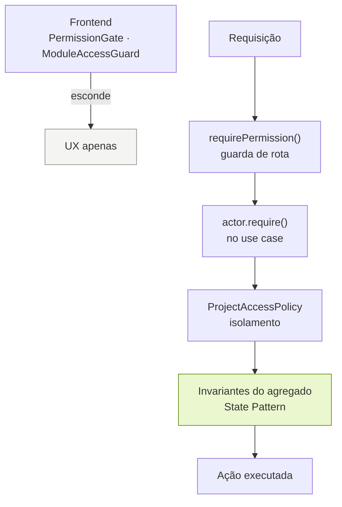

# Permissões e Autorização

## Sumário

- [Modelo](#modelo)
- [Catálogo de permissões](#catálogo-de-permissões)
- [Hierarquia ACCESS](#hierarquia-access)
- [Matriz dos perfis de sistema](#matriz-dos-perfis-de-sistema)
- [Rastreabilidade com o escopo original](#rastreabilidade-com-o-escopo-original)
- [Autorização por projeto](#autorização-por-projeto)
- [Elegibilidade do responsável](#elegibilidade-do-responsável)
- [Onde a autorização é aplicada](#onde-a-autorização-é-aplicada)
- [O assistente de IA e as permissões](#o-assistente-de-ia-e-as-permissões)
- [Perfis customizados](#perfis-customizados)

---

## Modelo

Três conceitos, cada um respondendo a uma pergunta distinta:

| Conceito | Pergunta | Exemplo |
|---|---|---|
| **Role** | Qual o perfil global da pessoa? | Agilista |
| **Permission** | *O que* ela pode fazer? | `DEMAND_DELETE` |
| **ProjectMember** | *Onde* ela pode fazer? | Portal do Cliente |

> **Role → o QUE pode fazer.  ProjectMember → ONDE pode fazer.**

As duas dimensões são verificadas de forma independente e ambas precisam passar.

Nenhuma decisão de autorização testa o nome de um perfil. Não existe
`if (role === 'ADMIN')` no código: o comportamento vem sempre da permissão, o que
mantém perfis customizados como cidadãos de primeira classe.

---

## Catálogo de permissões

Permissões são **semânticas**, não um CRUD genérico. Quando aparece uma ação de domínio
específica, ela ganha a própria permissão — `DEMAND_BE_ASSIGNEE` é o exemplo claro: não é
um "update".

O quadro Kanban **não é um módulo à parte** — é uma visão sobre demandas, e é governado
pelas mesmas permissões de Demandas. Uma versão anterior tinha `KANBAN_ACCESS` e
`KANBAN_MOVE` como permissões próprias, mas nos três perfis do escopo original as duas
sempre andavam junto de `DEMAND_ACCESS` e `DEMAND_UPDATE` — nunca uma sem a outra — e a
própria rota `/kanban` já exigia `DEMAND_ACCESS` além de `KANBAN_ACCESS` para fazer
qualquer coisa. A separação não protegia nenhum cenário real; só obrigava quem já podia
editar uma demanda a precisar de uma segunda permissão, concedida à parte, só para poder
arrastar o card ou trocar o status pelo seletor. Unificado: acessar o quadro é
`DEMAND_ACCESS`, e mover um card é `DEMAND_UPDATE`, o mesmo que qualquer outra edição de
escopo na demanda.

### Demandas (inclui o quadro Kanban)

| Código | Descrição |
|---|---|
| `DEMAND_ACCESS` | Acessar demandas e seus detalhes, incluindo o quadro Kanban |
| `DEMAND_VIEW_ALL` | Visualizar todas as demandas, e não apenas as que são suas |
| `DEMAND_CREATE` | Cadastrar novas demandas |
| `DEMAND_CREATE_WITH_STATUS` | Criação de demanda por status |
| `DEMAND_UPDATE` | Gerenciar demandas existentes (editar e alterar status) |
| `DEMAND_MANAGE_ALL` | Gerenciar demandas de qualquer pessoa, e não apenas as suas |
| `DEMAND_UPDATE_PRIORITY` | Alterar a prioridade de uma demanda |
| `DEMAND_UPDATE_DUE_DATE` | Alterar o prazo de uma demanda |
| `DEMAND_UPDATE_RESPONSIBLE` | Alterar o responsável por uma demanda |
| `DEMAND_UPDATE_PROJECT` | Transferir uma demanda para outro projeto |
| `DEMAND_MANAGE_PRODUCTION` | Gerenciar demandas em produção (reabrir e mudar o status de novo) |
| `DEMAND_DELETE` | Excluir demandas |
| `DEMAND_BE_ASSIGNEE` | Poder ser responsável por uma demanda |
| `DEMAND_COMMENT` | Comentar em demandas |

`DEMAND_CREATE_WITH_STATUS` é independente de `DEMAND_UPDATE` — é uma capability de
criação, não de edição ou de arraste. Sem ela, o "+" por coluna do Kanban
([requisito adicionado #40](ADDED_REQUIREMENTS.md#40-adicionar-demanda-direto-na-coluna-do-kanban))
simplesmente não aparece, e toda demanda nasce em "Não iniciada" — exatamente como antes
de o requisito existir.

`DEMAND_UPDATE` cobre editar qualquer atributo de uma demanda existente, **inclusive o
status** — mover um card (arrastar ou pelo seletor no painel) é uma mudança de escopo
sobre uma demanda que já existe, não uma ação de domínio própria.

**`DEMAND_MANAGE_ALL` é o par de `DEMAND_VIEW_ALL` do lado da escrita, e propositalmente
não implícito por ele.** Ver o quadro inteiro é uma questão de leitura; ser confiado para
editar, mover, arquivar, excluir ou mexer no checklist de uma demanda que não é sua nem
foi criada por você é uma concessão separada, decidida à parte. Sem `DEMAND_MANAGE_ALL`,
`DEMAND_UPDATE` (e tudo que depende dela) só alcança demandas das quais o ator é
responsável ou autor — a mesma regra que `DemandAccessGuard.loadManageable` aplica no
backend, independentemente de `DEMAND_VIEW_ALL` já deixar essas mesmas demandas visíveis
no quadro. Tentar gerenciar uma demanda alheia sem essa permissão responde `403
DEMAND_NOT_OWN` (não `404`: a demanda é visível, só a escrita é recusada).

**Prioridade, prazo, responsável e projeto exigem, cada um, uma permissão própria além
de `DEMAND_UPDATE`** — a mesma relação de dependência de `DEMAND_CREATE_WITH_STATUS` com
`DEMAND_CREATE`: inerte sem o pai, e verificada no caso de uso (`UpdateDemand`), não pela
cascata automática de ACCESS do `PermissionSet` (que só alcança a ACCESS do módulo).
`DEMAND_UPDATE` sozinho já cobre título, descrição e status — o "gerenciar" do próprio
enunciado do escopo; as quatro filhas existem para um perfil mais restrito: alguém pode
renomear uma demanda, reescrever sua descrição e movê-la pelo quadro sem também poder
repriorizá-la, adiar seu prazo, reatribuí-la ou transferi-la para outro projeto. Na seed,
o Agilista tem as quatro e também `DEMAND_MANAGE_ALL` — o papel de coordenar o quadro do
time inteiro pressupõe gerenciar cards que não são dela. O Desenvolvedor tem
`DEMAND_UPDATE` mas nenhuma delas nem `DEMAND_MANAGE_ALL` — pode gerenciar suas próprias
demandas no sentido restrito; tanto essas quatro decisões quanto qualquer card alheio
ficam com o Agilista.

`DEMAND_MANAGE_PRODUCTION` é a única exceção controlada à regra de que produção é
terminal ([requisito adicionado #41](ADDED_REQUIREMENTS.md#41-produção-reversível-para-quem-gerencia)).
Sem ela, mover uma demanda para produção pede confirmação antes — o registro trava para
sempre a partir daí — e nada além disso muda: a demanda continua congelada exatamente
como sempre foi. Com ela, produção é só mais uma coluna: sem confirmação para entrar, e
o controle de status continua ativo para tirar a demanda de lá quando quiser. O restante
do registro (título, descrição, prazo, responsável, projeto, checklist, anexos) continua
congelado mesmo para quem tem essa permissão — só o status é reaberto.

### Usuários

| Código | Descrição |
|---|---|
| `USER_ACCESS` | Acessar a gestão de usuários |
| `USER_CREATE` | Cadastrar novos usuários |
| `USER_UPDATE` | Editar usuários existentes |

### Projetos

| Código | Descrição |
|---|---|
| `PROJECT_ACCESS` | Acessar projetos dos quais participa |
| `PROJECT_ACCESS_ALL` | Acessar **todos** os projetos, independente de alocação |
| `PROJECT_CREATE` | Cadastrar novos projetos |
| `PROJECT_UPDATE` | Editar projetos existentes |
| `PROJECT_MANAGE_MEMBERS` | Gerenciar alocação de usuários em projetos |
| `PROJECT_MANAGE_INTEGRATION` | Gerar e revogar credenciais de integração do projeto |

### Perfis

| Código | Descrição |
|---|---|
| `ROLE_ACCESS` | Acessar a gestão de perfis |
| `ROLE_CREATE` | Cadastrar novos perfis |
| `ROLE_UPDATE` | Editar perfis e suas permissões |

### Logs

| Código | Descrição |
|---|---|
| `LOG_ACCESS` | Acessar o módulo de Logs; ver atividade de demandas e projetos visíveis |
| `LOG_VIEW_ORGANIZATION` | Ver atividade sem projeto: usuários, perfis, sessões |
| `LOG_VIEW_SYSTEM` | Ver a aba Sistema (permissões negadas, regras recusadas, erros) |

`LOG_ACCESS` segue exatamente a visibilidade de projetos do quem a possui — não abre uma
visão paralela. `LOG_VIEW_ORGANIZATION` e `LOG_VIEW_SYSTEM` são visões adicionais,
independentes uma da outra. Detalhes de escopo e visibilidade em
[`ADDED_REQUIREMENTS.md`, item 30](ADDED_REQUIREMENTS.md#30-módulo-de-logs-atividade-e-sistema).

### Assistente de IA

| Código | Descrição |
|---|---|
| `ASSISTANT_ACCESS` | Usar o assistente de IA (Ação rápida) |
| `ASSISTANT_MANAGE` | Ativar o assistente, escolher o modelo e trocar a chave da API |

`ASSISTANT_ACCESS` não amplia nada do que a pessoa pode ver ou fazer — ver
[O assistente de IA e as permissões](#o-assistente-de-ia-e-as-permissões).

O catálogo é **code-first**: são o vocabulário contra o qual o código verifica
autorização, e por isso não podem ser criadas por usuário. O que é totalmente
data-driven é *quais* permissões cada perfil possui.

29 permissões ao todo, em 6 módulos.

---

## Hierarquia ACCESS

`<MÓDULO>_ACCESS` é a permissão **soberana** de cada módulo. Todas as demais permissões
daquele módulo são suas filhas e **não têm efeito sem ela**.

```
DEMAND_ACCESS
  ├── DEMAND_VIEW_ALL
  ├── DEMAND_CREATE
  ├── DEMAND_UPDATE
  │     ├── DEMAND_MANAGE_ALL           (idem — sem ela, só demandas próprias)
  │     ├── DEMAND_UPDATE_PRIORITY      (verificada em UpdateDemand, não pela cascata de ACCESS)
  │     ├── DEMAND_UPDATE_DUE_DATE      (idem)
  │     ├── DEMAND_UPDATE_RESPONSIBLE   (idem)
  │     └── DEMAND_UPDATE_PROJECT       (idem)
  ├── DEMAND_MANAGE_PRODUCTION
  ├── DEMAND_DELETE
  └── DEMAND_BE_ASSIGNEE
```

### Comportamento

**No backend (autoridade).** Se `DEMAND_ACCESS` estiver ausente, todas as filhas do
módulo tornam-se inefetivas — **mesmo que estejam persistidas**. Uma inconsistência
gravada no banco nunca amplia autoridade.

**Na gestão de perfis (UX).**

- Ao desabilitar `ACCESS`: as permissões dependentes são desmarcadas e seus controles
  desabilitados.
- Ao habilitar uma permissão filha: `ACCESS` é habilitada automaticamente.

### Onde a regra vive

A regra está implementada **uma única vez** no backend, na classe `PermissionSet`
(`backend/src/modules/iam/domain/permission-set.ts`):

| Método | Papel |
|---|---|
| `effective()` | Descarta filhas de módulos sem `ACCESS` — base de toda decisão de autorização e de toda resposta da API |
| `normalize()` | Antes de persistir: adiciona o `ACCESS` implicado e remove filhas órfãs, para que o banco não guarde a contradição |

Nada mais no sistema re-deriva essa regra. O middleware de autorização, o editor de
perfis e o payload de permissões enviado ao frontend passam todos por essa classe.

O frontend possui um espelho em `features/roles/permissionPolicy.ts`, usado apenas para
que os checkboxes respondam instantaneamente ao clique. É conveniência, não autoridade:
o servidor normaliza o conjunto novamente ao gravar e, mais importante, trata `ACCESS`
como soberana ao resolver permissões em tempo de requisição. Se os dois discordarem, o
servidor vence e nada é concedido silenciosamente.

Também é por isso que existe `POST /api/v1/roles/permissions/normalize`: o cliente pode
perguntar ao servidor no que uma seleção realmente resulta.

---

## Matriz dos perfis de sistema

Os três perfis originais são `is_system = true`, têm UUIDs determinísticos e são
restaurados por `npm run db:seed`.

| Permissão | Administrador | Agilista | Desenvolvedor |
|---|:---:|:---:|:---:|
| `DEMAND_ACCESS` | ✅ | ✅ | ✅ |
| `DEMAND_VIEW_ALL` | ✅ | ✅ | ✅ |
| `DEMAND_CREATE` | ✅ | ✅ | ❌ |
| `DEMAND_CREATE_WITH_STATUS` | ❌ | ✅ | ❌ |
| `DEMAND_UPDATE` | ❌ | ✅ | ✅ |
| `DEMAND_MANAGE_ALL` | ❌ | ✅ | ❌ |
| `DEMAND_UPDATE_PRIORITY` | ❌ | ✅ | ❌ |
| `DEMAND_UPDATE_DUE_DATE` | ❌ | ✅ | ❌ |
| `DEMAND_UPDATE_RESPONSIBLE` | ❌ | ✅ | ❌ |
| `DEMAND_UPDATE_PROJECT` | ❌ | ✅ | ❌ |
| `DEMAND_MANAGE_PRODUCTION` | ❌ | ✅ | ❌ |
| `DEMAND_DELETE` | ❌ | ✅ | ❌ |
| `DEMAND_BE_ASSIGNEE` | ❌ | ✅ | ✅ |
| `DEMAND_COMMENT` | ✅ | ✅ | ✅ |
| `USER_ACCESS` | ✅ | ❌ | ❌ |
| `USER_CREATE` | ✅ | ❌ | ❌ |
| `USER_UPDATE` | ❌ | ❌ | ❌ |
| `PROJECT_ACCESS` | ✅ | ✅ | ✅ |
| `PROJECT_ACCESS_ALL` | ✅ | ✅ | ❌ |
| `PROJECT_CREATE` | ✅ | ❌ | ❌ |
| `PROJECT_UPDATE` | ✅ | ❌ | ❌ |
| `PROJECT_MANAGE_MEMBERS` | ✅ | ❌ | ❌ |
| `PROJECT_MANAGE_INTEGRATION` | ✅ | ❌ | ❌ |
| `ROLE_ACCESS` | ✅ | ❌ | ❌ |
| `ROLE_CREATE` | ✅ | ❌ | ❌ |
| `ROLE_UPDATE` | ✅ | ❌ | ❌ |
| `LOG_ACCESS` | ✅ | ✅ | ❌ |
| `LOG_VIEW_ORGANIZATION` | ✅ | ❌ | ❌ |
| `LOG_VIEW_SYSTEM` | ✅ | ❌ | ❌ |
| `ASSISTANT_ACCESS` | ✅ | ✅ | ✅ |
| `ASSISTANT_MANAGE` | ✅ | ❌ | ❌ |
| **Total** | **19** | **12** | **6** |

Note que o Administrador **não** possui `DEMAND_UPDATE` (o que também cobre mover cards no
Kanban), nem `DEMAND_DELETE` nem `DEMAND_BE_ASSIGNEE` — exatamente como o escopo original
determina.

`DEMAND_COMMENT` e `LOG_ACCESS` (para a Agilista), `DEMAND_COMMENT` (para o
Desenvolvedor), `ASSISTANT_ACCESS` (para os três perfis), `ASSISTANT_MANAGE` (para o
Administrador) e `DEMAND_CREATE_WITH_STATUS` (para a Agilista) são requisitos
adicionados — ver
[`ADDED_REQUIREMENTS.md`, itens 30, 32, 39 e 40](ADDED_REQUIREMENTS.md) — e não alteram
nenhuma regra original da tabela acima.

`DEMAND_MANAGE_PRODUCTION` (para a Agilista) é diferente dos demais: é a **única**
concessão desta tabela que muda o resultado de uma regra original em vez de só adicionar
uma capability nova — quem a possui deixa de estar sujeito a "produção é terminal". Ver a
justificativa completa em
[`ADDED_REQUIREMENTS.md`, item 41](ADDED_REQUIREMENTS.md#41-produção-reversível-para-quem-gerencia).

---

## Rastreabilidade com o escopo original

Cada regra funcional do PDF mapeada para a permissão que a implementa:

### Administrador

| Regra do escopo | Permissão |
|---|---|
| Pode cadastrar usuários | `USER_CREATE` ✅ |
| Pode cadastrar demandas | `DEMAND_CREATE` ✅ |
| **Não** pode editar demandas | `DEMAND_UPDATE` ausente ✅ |
| **Não** pode excluir demandas | `DEMAND_DELETE` ausente ✅ |
| Pode acessar o Kanban | `DEMAND_ACCESS` ✅ |
| Pode acessar cards no Kanban | `DEMAND_ACCESS` ✅ |

### Agilista

| Regra do escopo | Permissão |
|---|---|
| Pode cadastrar demandas | `DEMAND_CREATE` ✅ |
| Pode editar demandas | `DEMAND_UPDATE` ✅ |
| Pode excluir demandas | `DEMAND_DELETE` ✅ |
| **Não** pode cadastrar usuários | `USER_CREATE` ausente ✅ |
| Pode acessar o Kanban | `DEMAND_ACCESS` ✅ |
| Pode mover **qualquer** card no Kanban | `DEMAND_UPDATE` + `DEMAND_MANAGE_ALL` ✅ |
| Pode excluir **qualquer** card no Kanban | `DEMAND_DELETE` + `DEMAND_MANAGE_ALL` ✅ |
| Pode editar **qualquer** card no Kanban | `DEMAND_UPDATE` + `DEMAND_MANAGE_ALL` ✅ |

### Desenvolvedor

| Regra do escopo | Permissão |
|---|---|
| Pode acessar o Kanban | `DEMAND_ACCESS` ✅ |
| Pode mover **suas próprias** cards no Kanban | `DEMAND_UPDATE` ✅ (sem `DEMAND_MANAGE_ALL`, um card alheio responde 403) |
| Pode acessar cards no Kanban | `DEMAND_ACCESS` ✅ |
| Pode editar **suas próprias** cards no Kanban | `DEMAND_UPDATE` ✅ (idem) |

`DEMAND_VIEW_ALL` é concedida aos três perfis porque o escopo original descreve um quadro
compartilhado — quem está alocado num projeto vê o trabalho daquele projeto — e a seed
existe para reproduzir o escopo original. A permissão existe para que uma instalação
**possa** estreitar isso: desmarcá-la para um perfil, em Perfis, faz o Kanban daquele
perfil passar a mostrar apenas as demandas das quais ele é responsável ou autor, sem
alteração de código e sem re-seed.

Sozinha, `DEMAND_VIEW_ALL` só alarga *de quem* são as demandas visíveis **dentro** dos
projetos que o ator já alcança (`ProjectAccessPolicy`) — *quais* projetos isso são
continua limitado pela alocação, a menos que o perfil também tenha `PROJECT_ACCESS_ALL`.
O Agilista tem as duas: o papel de acompanhar a entrega de vários times não faz sentido
limitado aos projetos em que a pessoa foi manualmente alocada, então `PROJECT_ACCESS_ALL`
é requisito adicionado para este perfil (ver [`ADDED_REQUIREMENTS.md`](ADDED_REQUIREMENTS.md)).
Sem ela, um Agilista recém-criado — ou simplesmente não alocado a projeto nenhum — via um
Kanban quase vazio apesar de ter toda permissão de Demandas concedida.

`DEMAND_BE_ASSIGNEE` é concedida a Agilista e Desenvolvedor porque o escopo determina que
o campo responsável liste "todos os desenvolvedores e agilistas da base". Expressá-la como
capability — em vez de comparar nomes de perfil — permite que um perfil customizado
também assuma demandas sem alteração de código.

---

## Autorização por projeto

Para **ler** uma demanda (listagem, detalhe, comentários, histórico):

1. o usuário possui `DEMAND_ACCESS`; **e**
2. o usuário tem acesso ao projeto da demanda; **e**
3. o usuário possui `DEMAND_VIEW_ALL` **ou** é responsável pela demanda ou seu autor.

O critério 2 não se aplica a uma demanda sem projeto: não há projeto cuja participação
pudesse ser verificada, então é o critério 3 que a delimita sozinho.

O acesso ao projeto existe quando:

- existe `ProjectMember` ligando usuário e projeto; **ou**
- o usuário possui `PROJECT_ACCESS_ALL`.

Aplicado uniformemente em toda leitura. `DemandAccessGuard.loadAccessible()` é o único
caminho até uma demanda para leitura, o que impede que um endpoint futuro esqueça o
segundo critério.

**Gerenciar uma demanda** (atualização, exclusão, movimentação de status, checklist,
anexos) exige tudo isso e mais um critério: `DEMAND_MANAGE_ALL` **ou** ser responsável
pela demanda ou seu autor — o critério 3 sozinho (`DEMAND_VIEW_ALL`) não basta. Ver a
demanda e ser confiado para alterá-la são perguntas diferentes: um perfil pode enxergar
o quadro inteiro do time por contexto sem por isso poder mexer no trabalho de outra
pessoa. `DemandAccessGuard.loadManageable()` é o único caminho até uma demanda para
escrita — chama `loadAccessible()` primeiro e então aplica esse critério a mais,
respondendo `403 DEMAND_NOT_OWN` (não `404`, já que a demanda é visível) quando ele
falha.

**Projeto inacessível responde `404 PROJECT_NOT_FOUND`, não `403`.** Confirmar que um
projeto existe já vazaria informação através da fronteira de isolamento.

**Por que `PROJECT_ACCESS_ALL` e não um teste por perfil.** O sistema permite perfis
customizados. Como capability, a regra é data-driven: revogue a permissão do
Administrador pela interface e o mesmo código passa a restringi-lo às suas alocações.

---

## Elegibilidade do responsável

Na V1 existe **um** responsável por demanda. Um usuário só pode assumi-la quando cumpre
as três condições:

1. está **ativo**;
2. **pertence ao mesmo projeto** da demanda;
3. possui a capability **`DEMAND_BE_ASSIGNEE`**.

A regra vive em `AssigneeEligibility` (domínio), que produz erros específicos:

| Situação | Código |
|---|---|
| Usuário não existe | `RESPONSIBLE_NOT_FOUND` (404) |
| Usuário inativo | `RESPONSIBLE_INACTIVE` (422) |
| Não pertence ao projeto | `RESPONSIBLE_NOT_PROJECT_MEMBER` (422) |
| Perfil não permite assumir demandas | `RESPONSIBLE_CANNOT_BE_ASSIGNEE` (422) |

A listagem do combobox aplica os mesmos três critérios em SQL, de forma orientada a
capability. Um perfil customizado que receba `DEMAND_BE_ASSIGNEE` aparece na lista sem
nenhuma mudança de código.

A regra existe no backend e é verificada tanto na criação quanto na edição.

---

## Onde a autorização é aplicada



| Camada | Papel | É autoridade? |
|---|---|---|
| `PermissionGate` / `ModuleAccessGuard` | Esconde menus, rotas e botões | **Não** — é UX |
| `requirePermission()` | Rejeita cedo e documenta o requisito na tabela de rotas | Sim |
| `actor.require()` no use case | Verificação real, independente da rota | Sim |
| `ProjectAccessPolicy` | Isolamento por projeto | Sim |
| Invariantes do agregado | Produção terminal, elegibilidade | Sim |

O frontend esconder o botão é conforto; a API recusar a ação é a garantia. Ignorar o
frontend e chamar a API diretamente não concede nada — há testes de integração
exatamente para isso.

---

## O assistente de IA e as permissões

O assistente ([requisito adicionado #39](ADDED_REQUIREMENTS.md#39-assistente-de-ia-ação-rápida))
responde a cinco perguntas de autorização, e nenhuma resposta passa por cima das demais
permissões:

| Pergunta | Quem decide |
|---|---|
| A pessoa pode usar o assistente? | `ASSISTANT_ACCESS` |
| Pode pedir *esta* ação? | A permissão sob a qual o resultado seria aplicado: `DEMAND_CREATE` para um rascunho de demanda, `DEMAND_UPDATE` para um checklist planejado, `DEMAND_ACCESS` para relatórios, resumo da daily, riscos e perguntas |
| O que o modelo pode ler? | Exatamente as demandas que a pessoa já vê no quadro — a mesma `ProjectAccessPolicy` da listagem |
| O que a resposta pode fazer sozinha? | Nada. Rascunhos e checklists só viram dados quando a pessoa confirma, pelos endpoints comuns (`POST /demands`, `POST /demands/{uuid}/checklist`) e com as permissões comuns |
| Quem configura? | `ASSISTANT_MANAGE`: ativar ou desativar, trocar o modelo e a chave de API |

Uma ação explícita sem a permissão correspondente responde `403` **antes** de qualquer
chamada ao modelo — nem cota é gasta. Quando o pedido é texto livre e a classificação cai
numa ação que o perfil não pode executar, a resposta é uma explicação (`CLARIFY`) e não um
erro: é um mal-entendido sobre o que o assistente faz, não uma tentativa de contornar a
regra.

---

## Perfis customizados

`ROLE_CREATE` e `ROLE_UPDATE` permitem criar e editar perfis com qualquer combinação de
permissões do catálogo. O sistema inteiro reage automaticamente: menu lateral, rotas
acessíveis, botões visíveis e decisões da API derivam das permissões, nunca do nome.

**Perfis de sistema.** Mantêm o nome fixo (`SYSTEM_ROLE_IMMUTABLE` ao tentar renomear) e
não podem ser desativados, mas suas **permissões são editáveis** — o avaliador precisa
poder experimentar a matriz. `npm run db:seed` restaura a matriz original: a seed
substitui o conjunto de concessões, sendo corretiva e não apenas aditiva.

**Exclusão de perfil não está implementada nesta versão.** Exige tratar usuários
associados, reatribuição, proteção dos perfis de sistema e integridade referencial.
Registrada em [`IMPROVEMENTS.md`](IMPROVEMENTS.md) como Prioridade Futura 2.
